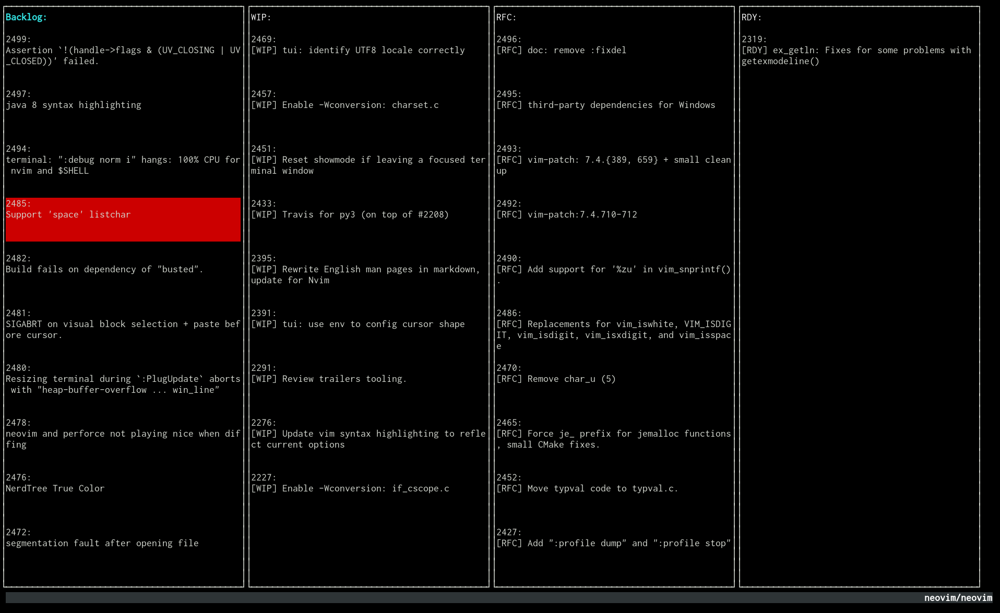

# stroop

A console-mode Github issue board written in [Go](http://golang.org)

<p align="center">
  
</p>


## Why
I love [waffle.io](http://waffle.io) and I love [vim](http://vim.org). One thing that frustrates me about using waffle.io's pretty UI is that I have to mouse around frequently to get anything done; adding comments, assigning labels, milestones, assignees, and so on. 

I want vim, but for the project managment experience, on top of Github issues.

(In Progress)

Early Screenshot:

## Getting Started
```
go get github.com/barakmich/stroop
```

Now, visit [GitHub's Settings Page](https://github.com/settings/applications)
and generate a new token. Copy that token to `~/.github.key`

```
cd some/git/repo
stroop
```

You might also consider creating a `~/.stroop.conf` file, to add boards and tags for specific `origin` repositories. An example such (JSON) file is:
```json
{
  "repos": {
    "neovim/neovim" : [
    {
      "column": "WIP",
      "tag": "WIP"
    },
    {
      "column": "RFC",
      "tag": "RFC"
    },
    {
      "column": "RDY",
      "tag": "RDY"
    }
    ]
  }
}
```

## License
BSD


